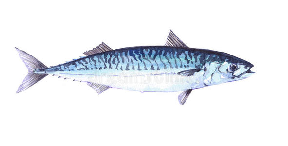

---

水中寻觅的鱼儿.

## ToDo 

- academic 公式自动编号
- academic toc not available with markup: mmark
- 需要学习了解的package
  - fraction
  - collections
  - `from functools import reduce
        from math import gcd
        from collections import Counter`

## Done

有幸完成的历史

#### 2019.10.20

- academic 学习笔记 导航栏 pagination 悬停
- academic table border and  head color 

#### 2019.09.15

- weight 的问题始终没搞明白
- 博客网页标签还是显示的Academic的图标 -32
- 学习笔记上一页/下一些
- 主站shortcut icon
- 可以考虑把[步骤6](https://fishszh.github.io/learning-hugo/notes/steps.html)

